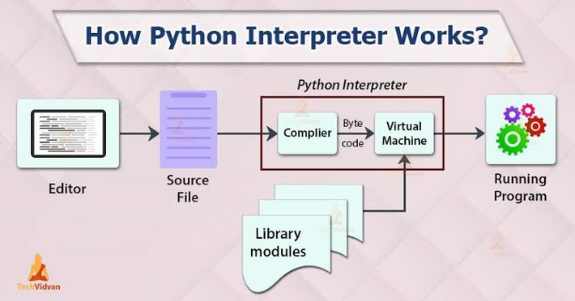
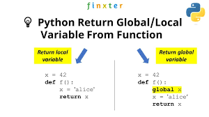
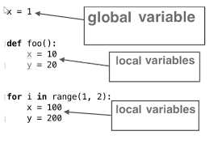

# Python 3 - Core
- Python is a popular programming language. It was created by Guido van Rossum, and released in 1991.


It is used for:

- web development (server-side),
- software development,
- mathematics,
- system scripting.


What can Python do?

- Python can be used on a server to create web applications.
    
- Python can be used alongside software to create workflows.
    
- Python can connect to database systems. It can also read and modify files.
    
- Python can be used to handle big data and perform complex mathematics.
    
- Python can be used for rapid prototyping, or for production-ready software development.(Prototyping means – any idea or projects beginner/starting model or demo version ).
    
    
Why Python?
    
- Python works on different platforms (Windows, Mac, Linux, Raspberry Pi, etc).
    
- Python has a simple syntax similar to the English language.
    
- Python has syntax that allows developers to write programs with fewer lines than some other programming languages.
    
- Python runs on an interpreter system, meaning that code can be executed as soon as it is written. This means that prototyping can be very quick.
    
- Python can be treated in a procedural way, an object-oriented way or a functional way.
    


#### First Program

- Create a file with any name with extension .py
- Write a code shown in below
- Run by using command - `python fileName.py`

```python
print("Hello, World!")
```

output

```bash
Hello, World!
```


### Check Python Version

```bash
python --version
```

output

```bash
Python 3.10.2
```


### Python Indentation

- Indentation refers to the spaces at the beginning of a code line.
- Where in other programming languages the indentation in code is for readability only, the indentation in Python is very important.
- Python uses indentation to indicate a block of code.

#### Corrected Code:

```python
if 5 > 2:
  print("Five is greater than two!")
```

output: Five is greater than two!

#### Wrong Code

```python
if 5 > 2:
print("Five is greater than two!")
```

output: File “demo_indentation_test.py”, line 2 print(“Five is greater than two!”) ^ IndentationError: expected an indented block


### Comments

- Comments can be used to explain Python code.
    
- Comments can be used to make the code more readable.
    
- Comments can be used to prevent execution when testing code.
    

```python
#This is a comment - use '#' this symbol to write comment
print("Hello, World!") #This is also comment
#print("Hello, World!")
```

##### Multi-line comments

```python
"""
This is a comment
written in
more than just one line
"""
print("Hello, World!")
```

### Bytecode

Bytecode in Python is an intermediate representation of Python source code that the Python interpreter executes. When a Python script is run, it is first compiled into bytecode, which is a set of instructions that are easier for the interpreter to understand and execute than the original source code. This compilation step is done automatically and transparently to the user. The bytecode is then executed by the Python Virtual Machine (PVM).

- Bytecode files typically have the extension .pyc and are stored in a **pycache** directory. The purpose of bytecode is to speed up the execution of Python programs. When a Python script is run for the first time, it is compiled into bytecode, and the bytecode is saved to a .pyc file. The next time the script is run, the interpreter can load the bytecode from the .pyc file instead of recompiling the source code, which can save time.
- Bytecode is platform-independent, meaning it can be run on any operating system with a compatible Python interpreter. However, bytecode is not machine code and cannot be executed directly by the CPU. It must be interpreted by the PVM.


### Python Program Workflow




### Variables

- Variables are containers for storing data values.
- Python has no keyword for declaring a variable.
- A variable is created the moment you first assign a value to it.

```py
x = 4       # x is of type int
y = "Akansha" # y is now of type str
z = True
a = 45.87
b = 'A'
print(x)
```

#### How to know type of a variable ?

You can get the data type of a variable with the `type()` function.

```py
x = 5
y = "Amresh"
print(type(x)) # int
print(type(y)) # str
```

- x = “Ram” is the same as x = ‘Ram’

#### Variable Name

A variable can have a short name (like x and y) or a more descriptive name (age, carname, total_volume).

Rules for Python variables:

- A variable name must start with a letter or the underscore character
- A variable name cannot start with a number
- A variable name can only contain alpha-numeric characters and underscores (A-z, 0-9, and _ )
- Variable names are case-sensitive (age, Age and AGE are three different variables)
- A variable name cannot be any of the Python keywords.

###### Legal Variable Names

```python
myvar = "Lakshman"
my_var = "Lakshman"
_my_var = "Lakshman"
myVar = "Lakshman"
MYVAR = "Lakshman"
myvar2 = "Lakshman"

```

###### Illegal Variable Names

```py
2myvar = "John"
my-var = "John"
my var = "John"
```


Styles for Variable Creation

#### Camel Case

Each word, except the first, starts with a capital letter:

`myVariableName = "John"`

#### Pascal Case

Each word starts with a capital letter:

`MyVariableName = "John"`

#### Snake Case

Each word is separated by an underscore character:

`my_variable_name = "John"`


#### Many Values to Multiple Variables

Python allows you to assign values to multiple variables in one line:

```py
x, y, z = "Orange", "Banana", "Cherry"
print(x) 
print(y)
print(z)
```

-  Note: Make sure the number of variables matches the number of values, or else you will get an error.

#### One Value to Multiple Variables

you can assign the same value to multiple variables in one line:

```py
x = y = z = "Orange"
print(x)
print(y)
print(z)
```

#### Global Variable vs Local Variable






### Reserved Keyword in Python

```python
False await else import pass  
None break except in raise  
True class finally is return  
and continue for lambda try  
as def from nonlocal while  
assert del global not with  
async elif if or yield

```

### Data Types

Python has the following data types built-in by default, in these categories:

- Text Type: str
- Numeric Types: int, float, complex
- Sequence Types: list, tuple, range
- Mapping Type: dict
- Set Types: set, frozenset
- Boolean Type: bool
- Binary Types: bytes, bytearray, memoryview
- None Type: NoneType


| Example                                      | Data Type |
|---------------------------------------------|-----------|
| x = "Hello World"                            | str       |
| x = 20                                       | int       |
| x = 20.5                                     | float     |
| x = 1j                                       | complex   |
| x = ["apple", "banana", "cherry"]           | list      |
| x = ("apple", "banana", "cherry")           | tuple     |
| x = range(6)                                 | range     |
| x = `{"name" : "Amresh", "age" : 25}`         | dict      |
| x = `{"apple", "banana", "cherry"} `          | set       |
| x = frozenset(`{"apple", "banana", "cherry"}`)| frozenset |
| x = True                                     | bool      |
| x = b"Hello"                                 | bytes     |
| x = bytearray(5)                             | bytearray |
| x = memoryview(bytes(5))                     | memoryview|
| x = None                                     | NoneType  |


### Casting

```py

# Integers:
x = int(1)   # x will be 1
y = int(2.8) # y will be 2
z = int("3") # z will be 3

# Floats:
x = float(1)     # x will be 1.0
y = float(2.8)   # y will be 2.8
z = float("3")   # z will be 3.0
w = float("4.2") # w will be 4.2

# Strings:
x = str("s1") # x will be 's1'
y = str(2)    # y will be '2'
z = str(3.0)  # z will be '3.0'

```


### Strings
Strings in python are surrounded by either single quotation marks, or double quotation marks.

'hello' is the same as "hello".

##### Multiline Strings
```py
a = """Lorem ipsum dolor sit amet,
consectetur adipiscing elit,
sed do eiusmod tempor incididunt
ut labore et dolore magna aliqua."""
print(a)
```

###### Slicing
```py
b = "Hello, World!"
print(b[2:5]) # llo
```

###### LowerCase UpperCase

```py
 a = "Hello, World!"
print(a.upper()) #HELLO, WORLD!
print(a.lower()) # hello, world!
```
###### Strip
The strip() method removes any whitespace from the beginning or the end:

```py
a = " Hello, World! "
print(a.strip()) # returns "Hello, World!"
```

##### String Concatenation
To concatenate, or combine, two strings you can use the + operator.

Merge variable a with variable b into variable c:

```py
a = "Hello"
b = "World"
c = a + b
print(c)
```

##### String Format
As we learned in the Python Variables chapter, we cannot combine strings and numbers like this:

Gives Error
```py
age = 36
txt = "My name is Rakesh, I am " + age
print(txt) # error
```

output:
```bash
Traceback (most recent call last):
  File "myfile.py", line 2, in <module>
    txt = "My name is Rakesh, I am " + age
TypeError: must be str, not int
```

To fix this problem use F String

```py
age = 36
txt = f"My name is John, I am {age}"
print(txt)
```

##### Escape Sequence

```py
name = "My name is "Amresh". I am from Gurugram"
print(name) # gives error
```

```py
name = "My name is \"Amresh\". I am from Gurugram"
print(name) # My name is "Amresh". I am from Gurugram
```

--- 
### Boolean
Booleans represent one of two values: True or False.

```py
print(10 > 9) # True
print(10 == 9) # False
print(10 < 9) # False
```

example:
```py
age = int(input("enter your age:"))
if age >= 18:
  print("You can vote")
else:
  print("You can not vote")
```

### Truthy and falsy values

#### Truthy:
- Almost any value is evaluated to True if it has some sort of content.

- Any string is True, except empty strings.

- Any number is True, except 0.

- Any list, tuple, set, and dictionary are True, except empty ones.

#### Falsy:
 - empty values, such as (), [], {}, "", False, the number 0, and the value None  evaluates to False.
 The following will return False:

```py
bool(False)
bool(None)
bool(0)
bool("")
bool(())
bool([])
bool({})
```

--- 

### Operators
Python divides the operators in the following groups:

- Arithmetic operators
- Assignment operators
- Comparison operators
- Logical operators
- Identity operators
- Membership operators
- Bitwise operators

#### Arithmetic 

| Operator | Name            | Example    |
|----------|-----------------|------------|
| `+`      | Addition        | `x + y`    |
| `-`      | Subtraction     | `x - y`    |
| `*`      | Multiplication  | `x * y`    |
| `/`      | Division        | `x / y`    |
| `%`      | Modulus         | `x % y`    |
| `**`     | Exponentiation  | `x ** y`   |
| `//`     | Floor division  | `x // y`   |


#### Assignment
| Operator | Example         | Same As       |
|----------|-----------------|---------------|
| `=`      | `x = 5`         | `x = 5`       |
| `+=`     | `x += 3`        | `x = x + 3`   |
| `-=`     | `x -= 3`        | `x = x - 3`   |
| `*=`     | `x *= 3`        | `x = x * 3`   |
| `/=`     | `x /= 3`        | `x = x / 3`   |
| `%=`     | `x %= 3`        | `x = x % 3`   |
| `//=`    | `x //= 3`       | `x = x // 3`  |
| `**=`    | `x **= 3`       | `x = x ** 3`  |
| `&=`     | `x &= 3`        | `x = x & 3`   |
| `|=`     | `x |= 3`        | `x = x | 3`   |
| `^=`     | `x ^= 3`        | `x = x ^ 3`   |
| `>>=`    | `x >>= 3`       | `x = x >> 3`  |
| `<<=`    | `x <<= 3`       | `x = x << 3`  |
| `:=`     | `print(x := 3)` | `x = 3; print(x)` |


#### Comparison
| Operator | Name                        | Example    |
|----------|-----------------------------|------------|
| `==`     | Equal                       | `x == y`   |
| `!=`     | Not equal                   | `x != y`   |
| `>`      | Greater than                | `x > y`    |
| `<`      | Less than                   | `x < y`    |
| `>=`     | Greater than or equal to    | `x >= y`   |
| `<=`     | Less than or equal to       | `x <= y`   |


#### Logical

| Operator | Description                                  | Example                          |
|----------|----------------------------------------------|----------------------------------|
| `and`    | Returns True if both statements are true     | `x < 5 and x < 10`               |
| `or`     | Returns True if one of the statements is true| `x < 5 or x < 4`                 |
| `not`    | Reverses the result                          | `not(x < 5 and x < 10)`          |

#### Identity 
| Operator  | Description                                             | Example       |
|-----------|---------------------------------------------------------|---------------|
| `is`      | Returns True if both variables are the same object      | `x is y`      |
| `is not`  | Returns True if both variables are not the same object  | `x is not y`  |


#### Bitwise

| Operator | Name                  | Description                                                                 | Example    |
|----------|-----------------------|-----------------------------------------------------------------------------|------------|
| `&`      | AND                   | Sets each bit to 1 if both bits are 1                                       | `x & y`    |
| `|`      | OR                    | Sets each bit to 1 if one of two bits is 1                                  | `x | y`    |
| `^`      | XOR                   | Sets each bit to 1 if only one of two bits is 1                             | `x ^ y`    |
| `~`      | NOT                   | Inverts all the bits                                                        | `~x`       |
| `<<`     | Zero fill left shift  | Shift left by pushing zeros in from the right, leftmost bits fall off       | `x << 2`   |
| `>>`     | Signed right shift    | Shift right by pushing copies of the leftmost bit in, rightmost bits fall off | `x >> 2` |


--- 
### If Else Statement

```py
a = 33
b = 33
if b > a:
  print("b is greater than a")
elif a == b:
  print("a and b are equal") 
```
---

### Datastructures
Python provides several inbuilt (built-in) data structures that are powerful, versatile, and widely used. These can be categorized into two types:

 1. Primitive (Basic) Data Structures
These are the most basic types.

- int	Integer numbers	x = 5
- float	Decimal numbers	pi = 3.14
- bool	Boolean values	flag = True
- str	String of characters	name = "Amresh"

 2. Non-Primitive (Advanced) Data Structures
These are more complex and often used for data manipulation.

 A. Built-in Collection Data Structures
Python provides 4 main built-in container data types:

### List (Ordered, Mutable, Allows Duplicates)

Syntax:

```py
 my_list = [1, 2, 3]
```

Features:

- Ordered by insertion.

- Mutable (can change elements).

- Allows duplicates.

Operations:

```py

my_list.append(4)
my_list.remove(2)
my_list[1] = 10
my_list.sort()

```

---

### Tuple (Ordered, Immutable, Allows Duplicates)
Syntax:
```py 
my_tuple = (1, 2, 3)
```

Features:

- Immutable (can't change once created).

- Used as keys in dictionaries (if containing only immutables).

```py
x = my_tuple[0]
len(my_tuple)
my_tuple.count(2)
```
---

### Set (Unordered, Mutable, No Duplicates)

Syntax:
```py
 my_set = {1, 2, 3}
```

Features:

- Unordered.

- No duplicates.

- Fast membership checking.


```py
my_set.add(4)
my_set.remove(1)
my_set.union({5, 6})
my_set.intersection({2, 3})
```

---

Dict (Key-Value Pairs, Unordered as of < Python 3.6, Ordered >= 3.7)
Syntax:
` my_dict = {'a': 1, 'b': 2}`

Features:

- Fast lookup by key.

- Keys must be hashable (immutable types like int, str, tuple).


```py
my_dict['c'] = 3
value = my_dict.get('a')
del my_dict['b']
keys = my_dict.keys()
```


### Match/Switch Case
Instead of writing many if..else statements, you can use the match statement.

The match statement selects one of many code blocks to be executed.

```py

day = 4
match day:
  case 1:
    print("Monday")
  case 2:
    print("Tuesday")
  case 3:
    print("Wednesday")
  case 4:
    print("Thursday")
  case 5:
    print("Friday")
  case 6:
    print("Saturday")
  case 7:
    print("Sunday")
    
```

---

### Loops

In Python, loops are used to execute a block of code repeatedly. There are two main types of loops in Python:

- 1. for Loop
Used to iterate over a sequence (like a list, tuple, string, or range).


Example:
```py
for i in range(5):
    print(i)
```
Output:
```bash
0
1
2
3
4
```

Looping over a list:

```py 
fruits = ["apple", "banana", "cherry"]
for fruit in fruits:
    print(fruit)
```
- 2. while Loop
Repeats as long as a condition is True.

```py
count = 0
while count < 5:
    print(count)
    count += 1
 ```   
Output:
```py
0
1
2
3
4
```
Additional Keywords:
break – exits the loop early

continue – skips the current iteration

else – can be used with both for and while loops


```py
for i in range(10):
    if i == 5:
        break  # exits loop
    if i % 2 == 0:
        continue  # skips even numbers
    print(i)
```

### Membership Operator
The membership operators are useful to test for membership in a sequence such as string, lists, tuples and dictionaries. 
There are two type of Membership operator:-
- `in `
- `not in`
